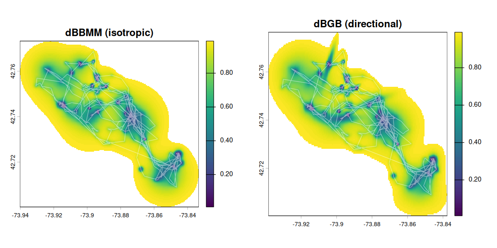

# move2utils

<!-- badges: start -->
[](NEWS.md)
[](https://gitlab.mpcdf.mpg.de/anenvi/r-packages/move2utils/-/pipelines)
[-blue.svg)](https://www.gnu.org/licenses/gpl-3.0)
[](https://www.r-project.org/)
<!-- badges: end -->

> **Public release.** `move2utils` is developed on [MPCDF GitLab](https://gitlab.mpcdf.mpg.de/anenvi/r-packages/move2utils) and mirrored here for public use. Please report bugs and ask questions by [opening an issue](https://github.com/move2universe/move2utils/issues).

Utility functions for animal-movement data stored as [`move2`](https://bartk.gitlab.io/move2/) objects. A home for a handful of ports from the legacy `move` package, together with a small amount of novel scientific machinery described in a companion paper.



## What's in the package

| Topic | Functions | Provenance |
|-------|-----------|------------|
| Utilisation distributions & variance | `mt_dbbmm_variance()`, `mt_dbbmm_ud()`, `mt_dbgb_variance()`, `mt_dbgb_ud()`, `mt_motion_variance()`, `mt_suggest_dbbmm_window()`, `ud_volume()`, `ud_outer_probability()`, `emd()` | Ported from `move`. C kernels kept; deprecated `sp` dependencies dropped in favour of `sf`/`terra`. |
| Corridor detection | `mt_corridor()` | Ported from `move::corridor()` (LaPoint et al. 2013). Spatial-indexing (`sf` R-tree) replaces the old `sp`/`rgeos` path. |
| Outlier detection — four primitives + unified entry-point | `mt_clean_track()` (unified entry-point), `mt_flag_outliers_bridge()`, `mt_flag_outliers_detour()`, `mt_flag_outliers()`, `mt_flag_speed_cap()`, `mt_peel_speed()`, `v_phys_estimate()`, `mt_suggest_speed_cap()`, `mt_diagnose_clean_track()`, `mt_flag_consensus()` | New. Four complementary primitives (geometric bridge-residual, path-vs-displacement detour ratio, probabilistic movement-metric, step-level speed cap) composable individually or through `mt_clean_track()` which iterates them under the evidence-corroborated consensus rule (the default; configurable via `consensus =`, e.g. the previous `"class_aware"`) plus topological block-expansion. Described in the companion paper. |
| Outlier detection — state-aware bridge variants (standalone) | `mt_flag_outliers_dbgb()`, `mt_flag_outliers_dbbmm()` | Estimate per-axis bridge motion variance and flag fixes via an envelope rule across three Z channels (`bridge_z_class` taxonomy); useful when behavioural states make a single global threshold over- or under-flag. Currently exported as standalone primitives, not wired into the cascade. |
| Outlier detection — alternative strategies | `mt_sequential_outliers()`, `mt_combined_outliers()` | Voting/scanning alternatives on the probability surface. See `?mt_clean_track`'s `@seealso` for when to reach for each. |
| Outlier detection — multi-scale persistence annotation | `mt_persistence_score()` | Detector-agnostic confidence helper. Annotates any flagger's output with a per-flag persistence score across temporal scales; recommended use is class-aware filtering on cascade output. See `vignette("OUTLIER_5_persistence_score")`. |
| Pre-cleaning helpers | `mt_filter_gps_quality()`, `mt_mask_segments()` | Drop fixes whose GPS geometry is unreliable; mask track segments by predicate. |
| Trajectory utilities | `mt_thin_distance()`, `mt_thin_time()` | Distance- and time-based thinning, preserving track IDs. |

All functions operate directly on `move2` objects and preserve CRS, track IDs, timestamps, and metadata.

## Installation

```r
# install.packages("remotes")

# MPCDF GitLab (the canonical home; CI builds the docs site here)
# GitHub (public release)
remotes::install_github("move2universe/move2utils", build_vignettes = TRUE)

remotes::install_gitlab("anenvi/r-packages/move2utils", host = "gitlab.mpcdf.mpg.de", build_vignettes=TRUE)
```

- **Required:** `move2`, `sf`, `terra`, `units`.
- **Suggested:** `circular`, `geosphere`, `MASS`, `lwgeom`, `lubridate`, `dplyr`, `parallel`, `testthat`, `knitr`.

## Quick tour

Each block below is copy-paste runnable on bundled example data and ends in a figure, so you can see what the package does before reading on.

### Utilisation distributions

```r
library(move2)
library(move2utils)
library(terra)
library(scales)

fishers <- mt_read(mt_example())
fishers <- fishers[!sf::st_is_empty(fishers), ]
leroy   <- fishers[mt_track_id(fishers) == "M1", ]

## Dynamic Brownian-bridge motion variance. `location_error` is the GPS
## error in metres; `window_size` / `margin` set the moving window for the
## variance breakpoint search (tune with `mt_suggest_dbbmm_window()`).
var <- mt_dbbmm_variance(leroy, location_error = 25, window_size = 31, margin = 7)
ud  <- mt_dbbmm_ud(var, dim_size = 600, ext = 1)        # isotropic UD raster
vol <- ud_volume(ud)                                    # cumulative-volume space
vol[vol[] > 0.99] <- NA                                 # keep the 99% range
vol <- terra::trim(vol)                                 # crop to the occupied area

## Directional (bivariate-Gaussian) variant. The directional kernel is
## elongated, so it needs a slightly larger `ext` to fit the raster.
var_d <- mt_dbgb_variance(leroy, location_error = 25, window_size = 31, margin = 7)
ud_d  <- mt_dbgb_ud(var_d, dim_size = 600, ext = 1.5)
vol_d <- ud_volume(ud_d)
vol_d[vol_d[] > 0.99] <- NA
vol_d <- terra::trim(vol_d)

par(mfrow = c(2, 1))
plot(vol,   main = "dBBMM (isotropic)")
plot(leroy, max.plot = 1, type = "l", add = TRUE, col = alpha("white", 0.5))
plot(vol_d, main = "dBGB (directional)")
plot(leroy, max.plot = 1, type = "l", add = TRUE, col = alpha("white", 0.5))
```

The UD is returned in the track's own CRS (here lon/lat), so the track overlays directly. See `vignette("UD_dbbmm_ud")` for the full workflow.

### Corridor detection

```r
## High-speed, low-variance passages (LaPoint et al. 2013).
out <- mt_corridor(leroy)
table(out$corridor)                          # corridor / not corridor

plot(sf::st_geometry(out), col = "grey80", pch = 20, cex = 0.5, asp = 1)
plot(sf::st_geometry(out)[out$corridor == "corridor"],
     col = "red", pch = 20, add = TRUE)
```

### Outlier cleaning

```r
## A bundled synthetic track that contains known outliers.
tracks <- mt_read(system.file("extdata/synthetic_tracks.csv.gz", package = "move2utils"))
cpf_a  <- filter_track_data(tracks, .track_id = "CPF_A")

## One call: iterates four detectors under evidence-corroborated flagging
## plus topological block expansion, auto-projects lon/lat internally, and
## returns in the original CRS. `plot = TRUE` (the default) draws the kept
## track with the removed locations marked.
clean <- mt_clean_track(cpf_a)

## Flag without removing, to inspect the decision:
flagged <- mt_clean_track(cpf_a, remove = FALSE)
table(flagged$is_outlier)
```

The four primitives (`mt_flag_outliers_bridge()`, `mt_flag_outliers_detour()`, `mt_flag_outliers()`, `mt_flag_speed_cap()`) can also be run on their own — see the table below. For the full workflow, choosing detectors, and reading the diagnostics, start at `vignette("OUTLIER_1_getting_started")`.

## Which function should I use?

| Task | Function |
|------|----------|
| Estimate dynamic motion variance | `mt_dbbmm_variance()` / `mt_dbgb_variance()` |
| Compute a utilisation distribution | `mt_dbbmm_ud()` / `mt_dbgb_ud()` |
| Flag corridor segments | `mt_corridor()` |
| **One-call outlier cleanup** | `mt_clean_track()` |
| Post-run health check on `mt_clean_track()` output | `mt_diagnose_clean_track()` |
| Geometric per-fix outlier detection (leverage-immune) | `mt_flag_outliers_bridge()` |
| Geometric, time-insensitive (path/displacement ratio) | `mt_flag_outliers_detour()` |
| Probabilistic per-fix outlier detection | `mt_flag_outliers()` |
| Step-level impossible-speed outlier detection | `mt_flag_speed_cap()` |
| Iterative speed peel for coherent multi-fix error clusters | `mt_peel_speed()` |
| Allometric physiological speed cap from `(mass, mode)` | `v_phys_estimate()` |
| Inspect a track's speed distribution and suggest a cap | `mt_suggest_speed_cap()` |
| Classify the *kind* of error at each flagged location (directional residual) | `mt_flag_outliers_bridge(method = "directional")` |
| State-aware bridge primitive with per-axis envelope rule + `bridge_z_class` taxonomy | `mt_flag_outliers_dbgb()` |
| Isotropic state-aware bridge primitive (faster; one Z channel) | `mt_flag_outliers_dbbmm()` |
| Sequential scan from confirmed-good fixes (alternative strategy) | `mt_sequential_outliers()` |
| Majority vote across gap / entropy / sequential strategies | `mt_combined_outliers()` |
| Per-flag confidence via multi-scale persistence (cascade or any flagger) | `mt_persistence_score()` |
| Short track with a longer clean reference | `mt_flag_outliers(x, reference = long)` |
| Pre-cleaning: drop fixes with bad GPS geometry | `mt_filter_gps_quality()` |

## Vignettes

The cleaning workflow has its own ordered set of vignettes; readers new to the package should walk them in this order.

**Outlier cleaning (workflow order):**

1. `vignettes/OUTLIER_1_getting_started.Rmd` — the one-call `mt_clean_track()` workflow on a bundled synthetic track with known outliers, then a brief tour of each primitive for users who want finer control.
2. `vignettes/OUTLIER_4_outlier_bridge.Rmd` — the geometric bridge-residual primitive in depth (combined / isotropic / directional methods, error-morphology classification).
3. `vignettes/OUTLIER_example_outlier_whitestork.Rmd` — a worked example on a real white-stork track with multi-state behaviour and migration spikes.
4. `vignettes/OUTLIER_2_diagnose_clean_track.Rmd` — **post-run health check**. Six diagnostic panels analogous to `plot.lm()` for a GLM; tells you when the cleaner over-flagged and points at the remedy. Read this if your `mt_clean_track()` result looks suspicious.
5. `vignettes/OUTLIER_3_state_conditional.Rmd` — recipe for the multi-state failure mode the diagnostic flags. The supported manual path until a first-class state-conditional API ships.

**Other utilities:**

- `vignettes/OUTLIER_example_leo_migration.Rmd` — worked outlier-detection example on long-distance migration data.
- `vignettes/UD_dbbmm_ud.Rmd` / `vignettes/UD_dbgb_ud.Rmd` / `vignettes/UD_ud_comparison.Rmd` — utilisation-distribution workflows.
- `vignettes/UD_bursted_uds.Rmd` — context-aware (per-burst) dBBMM/dBGB using the `dplyr` idiom that replaces `move::burst`.
- `vignettes/corridor.Rmd` — corridor detection on a raw track.
- `vignettes/UD_gap_aware_ud.Rmd` / `vignettes/interpolate_and_thin.Rmd` — supporting workflows.

## When the cleaner over-flags (and when to supply `(mass, mode)`)

`mt_clean_track()` has two failure modes the user should recognise. Both are documented by empirical benchmarks committed in this repo and are signalled by the diagnostic suite at run time.

### Failure mode 1 — multi-state behaviour with no real outliers

On tracks where the animal has very different speed regimes (resting at colony + flight, wintering + migration, perched + foraging), per-fix detectors threshold against the dominant baseline distribution and flag the *minority* state's fixes as anomalous — even when none are GPS errors.

**Empirical example:** *Columba livia* `Saline-20160803-048308` (homing pigeon, n = 5479). The pigeon has two modes — perched at the loft (0.10 m/s) and racing flight (15.2 m/s). With naive defaults `mt_clean_track()` flags 696 fixes (12.7 %) — *all of which are racing flight*, not GPS errors. Naive speed cap and `atlastools` correctly flag 0 on this track because the racing flight is biologically below the 30 m/s physiological cap.

Symptoms: very high flag rate (>5 %) on a track with no visible off-trajectory fixes; `mt_diagnose_clean_track()` Panel 1 shows multiple substantive modes; Panel 2 shows a sustained band of elevated flag rate corresponding to the minority state.

What to do: see [vignette("OUTLIER_3_state_conditional")](vignettes/OUTLIER_3_state_conditional.Rmd) — segment by speed mode, run `mt_clean_track()` per segment, recombine. Or filter the track to one state before cleaning.

### Failure mode 2 — block-shaped contamination at naive defaults

On tracks with sustained contaminated trains (GPS spoofs, deployment confusion, multi-fix data corruption) the auto-cap can land at biologically absurd values (the data's own outliers define a "gap" the auto-cap finds). The speed primitive then doesn't fire on the spoof boundaries reliably enough for block expansion to seed, so the contaminated train is silently kept.

**Empirical example:** K02 golden eagle (real Movebank study 2830439412, n = 851 k, 175-fix spoof in `2025-06-14`). With naive defaults `mt_clean_track()` recovers **0 / 175 spoof fixes** (auto-cap landed at 88 m/s, far above any biological eagle speed). With `(mass = 4.5, mode = "flying")` the same wrapper recovers **175 / 175** via block expansion.

Symptoms: very few final flags despite a track that obviously has contaminated regions; the wrapper now prints a "primitive-disagreement signature" warning when bridge caught flags the conjunction dropped — supplying mass+mode resolves this.

What to do: supply `(mass, mode)` to `mt_clean_track()` (auto-derives a Hirt 2017 physiological cap), or pass `v_max = <published_value>` for sprint-mode-aware species. The wrapper also warns when the auto-cap lands above 50 m/s.

### Empirical evidence

- **65-individual stratified Movebank audit** (`audits/2026-04-29-stratified-movebank/findings.md`): 75 % PASS, 95 % defensible, 0 crashes on naive defaults; the 5 % OVER_FLAG cases all hit Failure mode 1.
- **Three head-to-head benchmarks** (`benchmarks/2026-XX-XX-vs-competitors/`):
  - Phase 1 (synthetic): mt_clean F1 = 0.98, atlastools F1 = 0.74, naive F1 = 0.76, trip::sda F1 = 0.04.
  - Phase 2 (K02 spoof): mt_clean tier 1 (mass+mode) recovers 175/175; per-fix competitors recover 2/175 (boundaries only).
  - Phase 3 (audit subset, real multi-state): mt_clean over-flags 5892 multi-state behaviour fixes; naive and atlastools correctly flag 0.

Each adjustable parameter targets a specific empirically-distinguishable failure mode. The diagnostic suite tells the user which knob to reach for.

## Background

Several methods are ported onto `move2` from their original descriptions. The corridor concept follows LaPoint, Gallery, Wikelski & Kays (2013) *Landscape Ecology* 28: 1615–1630. The dynamic Brownian-bridge utilisation distribution and motion variance follow Horne, Garton, Krone & Lewis (2007) *Ecology* 88: 2354–2363 and Kranstauber, Kays, LaPoint, Wikelski & Safi (2012) *Journal of Animal Ecology* 81: 738–746, with the directional bivariate-Gaussian-bridge variant after Kranstauber, Safi & Bartumeus (2014) *Movement Ecology* 2: 5. Utilisation distributions are compared by the Earth mover's distance (Rubner, Tomasi & Guibas 2000 *International Journal of Computer Vision* 40: 99–121), computed via the Sinkhorn optimal-transport approximation (Cuturi 2013 *Advances in Neural Information Processing Systems* 26).

The outlier-detection framework — four complementary primitives (geometric bridge residual, path-vs-displacement detour ratio, probabilistic movement-metric, step-level speed cap) sharing a gap-aware non-parametric normalisation and combinable through an iterative unified detector with evidence-corroborated flagging (the default; `class_aware` and other rules selectable via `consensus =`) plus topological block expansion — is the novel scientific content of the package and is described in the companion paper (in preparation, *Methods in Ecology and Evolution*).

## Citation

If you use `move2utils`, please cite the Application Note; for the outlier-detection methodology specifically, also cite the companion paper (forthcoming on bioRxiv). `citation("move2utils")` returns both.

> Kranstauber B, Safi K, Scharf AK (2026). *`move2utils`: a utility toolkit for the `move2` ecosystem.* bioRxiv. doi:[10.64898/2026.07.07.736908](https://doi.org/10.64898/2026.07.07.736908).

> Safi K (2026). *Self-thresholding hierarchical outlier-detection for animal movement tracks.* bioRxiv (in preparation).

## Contributing

See `CONTRIBUTING.md` for the workflow (issue first, feature branches from `main`, R CMD check must stay green). The package is intentionally minimal in scope — `move2`-native utilities. Proposals outside that scope are likely better placed in their own package.

## License

GPL (>= 3). Full text in `LICENSE.md`.
